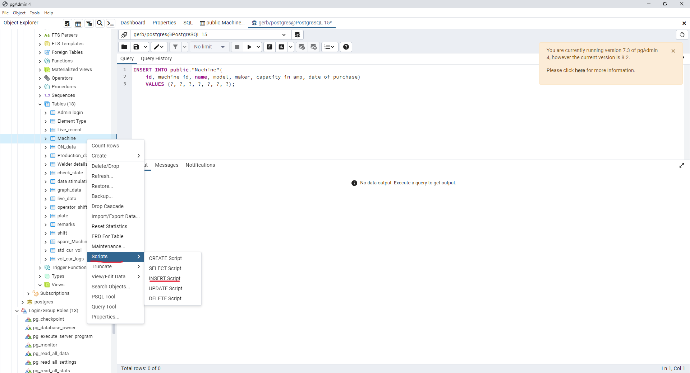

## Introduction

In this section of the documentation, you will find solutions addressing common issues that may arise.

###How to add a new machine?

**Backend:**

1. Navigate to the database, select the 'Schemas' tab, locate the 'Table' (Machine), right-click, and choose 'Script' to generate and insert the script.

  

2.Modify the values to reflect the appropriate data for the 'Machine' table.

  
  
**Frontend:**

